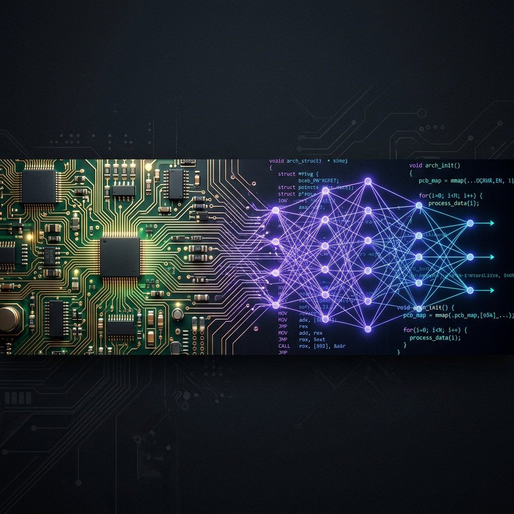

# Hi there! I'm Isha Das 👋
### Hardware & Software Enthusiast | System Architect | Build-everything Mindset

---

### 🔩 Hardware & Embedded

### 💻 Software & System

### 🧠 AI & Advanced Systems

  

---

### 📊 GitHub Insights

  
  

  

---

### 🌐 Connect With Me

  
  
  

