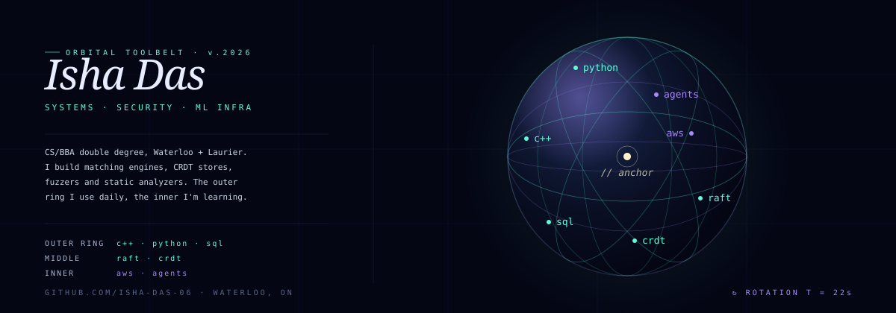

  

### why this orbit

Most of what I build is distributed systems and security tooling in C++ and Python, and the ring you see is roughly how long I've been leaning on each thing. Right now the inner ring is AWS and agentic ML, which is where my FilingsAnalyst work lives.

### what's at the center this week

> `anchor`, a durable execution runtime.

### things I've built

| project | what it is |
|---|---|
| matching engine | replicated order matching in C++17 with Raft and chaos-tested failover |
| CRDT KV store | geo-replicated key-value store in Python |
| fuzzer | coverage-guided fuzzer for C/C++ |
| taint analyzer | taint-tracking static analyzer |
| `peek` | static analyzer that catches look-ahead bias |
| `typolens` | supply-chain scanner for agent registries |
| FilingsAnalyst | agentic Q&A over SEC filings with a grounding checker and eval-gated CI |

[github.com/Isha-Das-06](https://github.com/Isha-Das-06)
